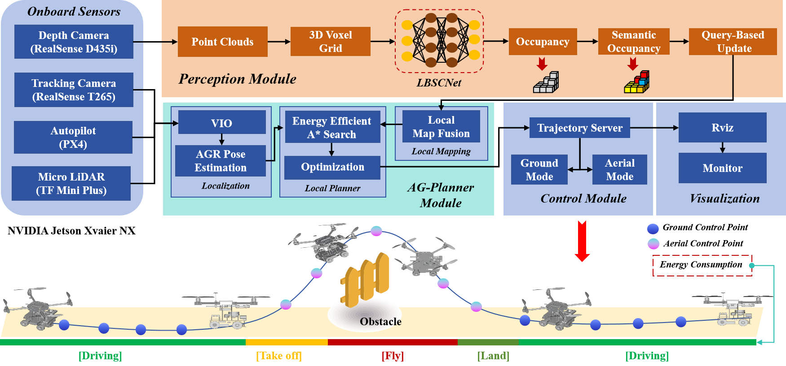

<div align="center">
    <h1>🤖 HE-Nav</h1>
    <h2>A High-Performance and Efficient Navigation System for Aerial-Ground Robots in Cluttered Environments</h2> <br>
    <a href='https://jmwang0117.github.io/HE_Nav.pdf'></a>
    <a href='https://jmwang0117.github.io/HE-Nav/'></a>
    
</div>

## 🎉 Chinese Media Reports/Interpretations
* [AMOV Lab Research Scholarship](https://mp.weixin.qq.com/s/AXbW3LDgsl9knQBIMwIpvA) -- 2024.11: 5000 RMB
* [AMOV Lab Research Scholarship](https://mp.weixin.qq.com/s/PUwY04sMpVmz30kSn6XdzQ) -- 2024.10: 5000 RMB

## 🤗 AGR-Family Works

* [OMEGA](https://jmwang0117.github.io/OMEGA/) (RA-L 2024.12): The First AGR-Tailored Dynamic Navigation System.
* [HE-Nav](https://jmwang0117.github.io/HE-Nav/) (RA-L 2024.09): The First AGR-Tailored ESDF-Free Navigation System.
* [AGRNav](https://github.com/jmwang0117/AGRNav) (ICRA 2024.01): The First AGR-Tailored Occlusion-Aware Navigation System.


## 📢 News
- [2024/07]: Experiment log of HE-Nav and its key components (i.e., LBSCNet and AG-Planner).

<div align="center">

| Task | Experiment Log |
|:------------------------------------------------------------------:|:----------:|
| LBSCNet training log|  [link](https://connecthkuhk-my.sharepoint.com/:u:/g/personal/u3009632_connect_hku_hk/ES4bK30J1clOmS_QbErWEbcBdcTGHclf2GcVHuiF8beDlA?e=j9Nvs4) |
|HE-Nav navigation in square room | [link](https://connecthkuhk-my.sharepoint.com/:t:/g/personal/u3009632_connect_hku_hk/EdDSBGd6BoRCk-Z6n6-Oq3MBvO2guMwuRzuY94yAGMjH3g?e=ArJnb1) |
|HE-Nav navigation in corridor    | [link](https://connecthkuhk-my.sharepoint.com/:t:/g/personal/u3009632_connect_hku_hk/EWIYOtw2NuJJv8DF3TtyBtwBMkXh9hHWtDJ0twzNZsbvxQ?e=7sxqtX) |
|AGRNav navigation in square room |  [link](https://connecthkuhk-my.sharepoint.com/:t:/g/personal/u3009632_connect_hku_hk/EWwc2nga055FmmZtjMzDKvUBQ_a0-4hvlR5JDgZp1YokPg?e=iO8vAR) |
|AGRNav navigation in corridor |  [link](https://connecthkuhk-my.sharepoint.com/:t:/g/personal/u3009632_connect_hku_hk/Ef9iKrhWWeRLuao_lIzrKj8BNYomkP32ySjGFZklH6AvoQ?e=xzTPwW) |
|TABV navigation in square room   |  [link](https://connecthkuhk-my.sharepoint.com/:t:/g/personal/u3009632_connect_hku_hk/ESVa9j_CYS1OowU9LHd2b5EBATIvytkssDNX61CksD1GzQ?e=Du56M3) |
|TABV navigation in corridor   |  [link](https://connecthkuhk-my.sharepoint.com/:t:/g/personal/u3009632_connect_hku_hk/EQSuP89F935IhDmJ3e_eGQYBu62tEfuYKRjRpHZy7AcUhw?e=e6Flgk) |

</div>


- [2024/04]: The [3D model ](https://connecthkuhk-my.sharepoint.com/:u:/g/personal/u3009632_connect_hku_hk/ERX7ejbV3xdOkLQe5SMgGG0Bh6D1qGd-9vg5iMWpi8VQsw?e=H07haj) in the simulation environment can be downloaded in OneDrive.
- [2024/04]: 🔥 We released the code of HE-Nav in the simulation environment. The pre-trained model can be downloaded at  [OneDrive](https://connecthkuhk-my.sharepoint.com/:u:/g/personal/u3009632_connect_hku_hk/Ef07DNxypO1KhwuMNbthmP8BgIeDdXJyaeq4uwi6hFKgRw?e=y2LYv2)

</br>

## 📜 Introduction

**HE-Nav** introduces a novel, efficient navigation system specialized for Autonomous Ground Robots (AGRs) in highly obstructed settings, optimizing both perception and path planning. It leverages a lightweight semantic scene completion network (LBSCNet) and an energy-efficient path planner (AG-Planner) to deliver high-performance, real-time navigation with impressive energy savings and planning success rates.


<p align="center">
  
</p>


<br>

```
@article{wang2024henav,
  title={HE-Nav: A High-Performance and Efficient Navigation System for Aerial-Ground Robots in Cluttered Environments},
  author={Wang, Junming and Sun, Zekai and Guan, Xiuxian and Shen, Tianxiang and Huang, Dong and Zhang, Zongyuan and Duan, Tianyang and Liu, Fangming and Cui, Heming},
  journal={IEEE Robotics and Automation Letters},
  year={2024},
  volume={9},
  number={11},
  pages={10383-10390},
  publisher={IEEE}
}
```
<br>

Please kindly star ⭐️ this project if it helps you. We take great efforts to develop and maintain it 😁.


## 🛠️ Installation
The code was tested with `python=3.6.9`, as well as `pytorch=1.10.0+cu111` and `torchvision=0.11.2+cu111`. 

Please follow the instructions [here](https://pytorch.org/get-started/locally/) to install both PyTorch and TorchVision dependencies. Installing both PyTorch and TorchVision with CUDA support is strongly recommended.

1. Clone the repository locally:

```
 git clone https://github.com/jmwang0117/HE-Nav.git
```
2. We recommend using **Docker** to run the project, which can reduce the burden of configuring the environment, you can find the Dockerfile in our project, and then execute the following command:
```
 docker build . -t skywalker_robot -f Dockerfile
```
3. After the compilation is complete, use our **one-click startup script** in the same directory:
```
 bash create_container.sh
```

 **Pay attention to switch docker image**

4. Next enter the container and use git clone our project
```
 docker exec -it robot bash
```
5. Then catkin_make compiles this project
```
 apt update && sudo apt-get install libarmadillo-dev ros-melodic-nlopt

```
6. Run the following commands 
```
pip install pyyaml
pip install rospkg
pip install imageio
catkin_make
source devel/setup.bash
sh src/run_sim.sh
```

You've begun this project successfully; **enjoy yourself!**


## 💽 Dataset

- [x] SemanticKITTI


## 🏆Acknowledgement

Many thanks to these excellent open source projects:
- [AGRNav](https://github.com/jmwang0117/AGRNav)
- [Prometheus](https://github.com/amov-lab/Prometheus)
- [LMSCNet](https://github.com/astra-vision/LMSCNet)
- [semantic-kitti-api](https://github.com/PRBonn/semantic-kitti-api)
- [Terrestrial-Aerial-Navigation](https://github.com/ZJU-FAST-Lab/Terrestrial-Aerial-Navigation)
- [SSA-SC](https://github.com/jokester-zzz/SSA-SC)
- [SSC-RS](https://github.com/Jieqianyu/SSC-RS)
- [Fast-Planner](https://github.com/HKUST-Aerial-Robotics/Fast-Planner)

